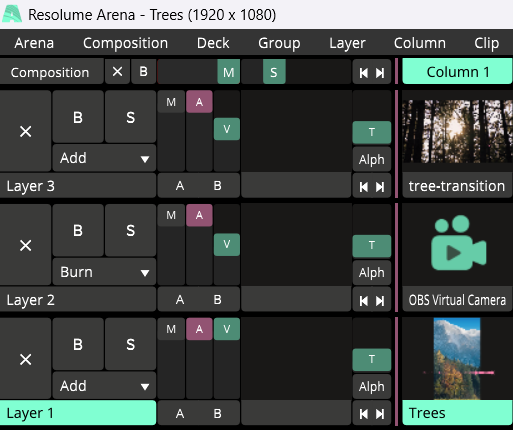
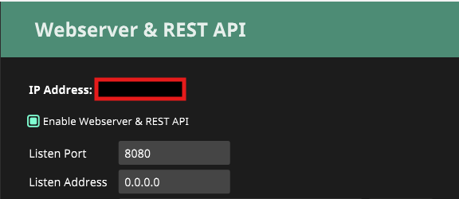
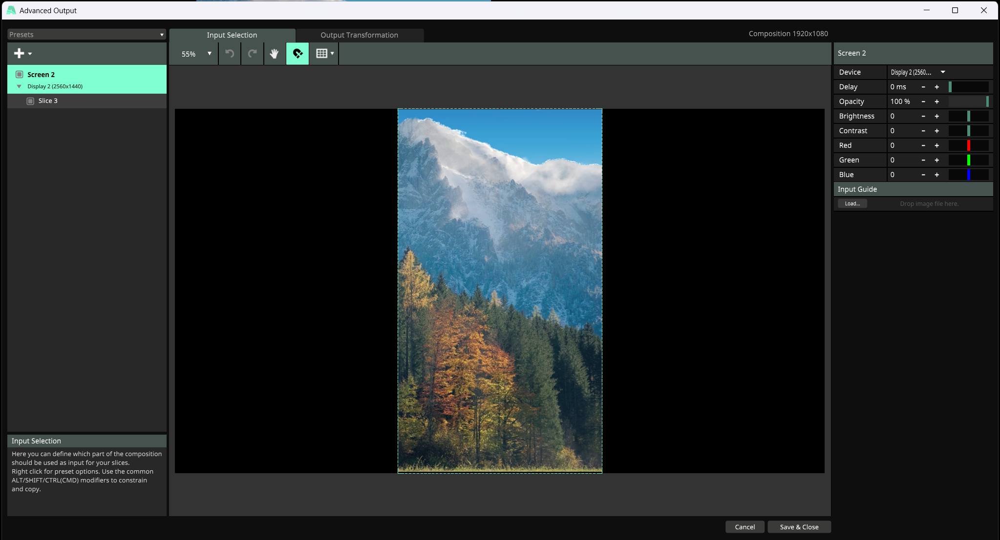
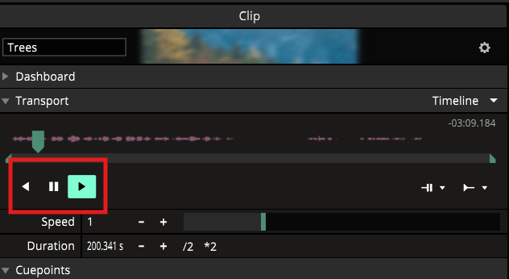
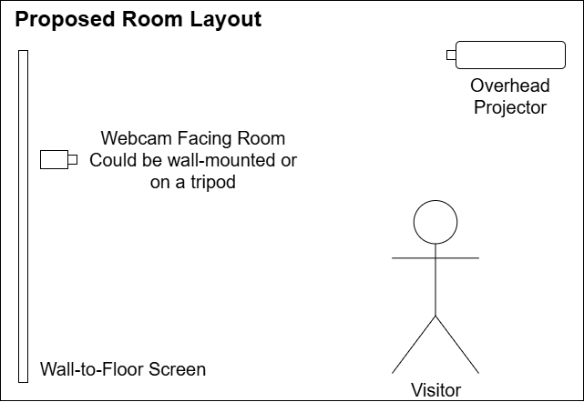
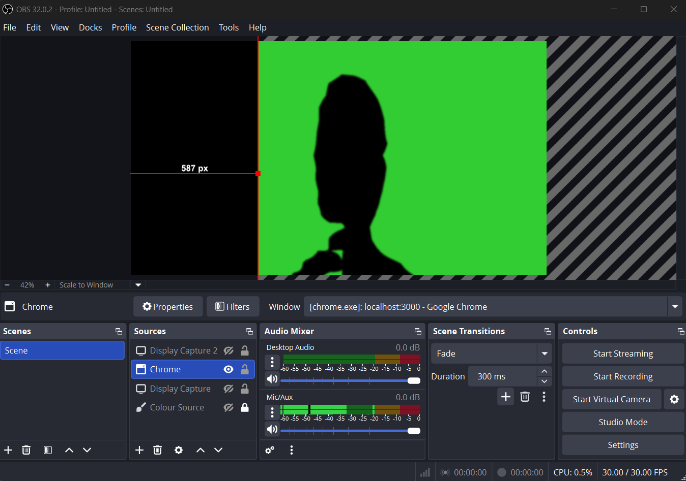

# Set Up Guide

## Requirements

### Software
- pnpm v10.24.0
- OBS Studio v32.0.2
- Resolume Arena v7.13.2
- Google Chrome latest version

### Hardware
- Webcam
- Overhead projector
- Projector screen

## Setup

First, download and extract the resolume-project folder from [Releases](https://github.com/robeecodes/projection-mapping/releases/tag/resolume-files) or [OneDrive](https://uweacuk-my.sharepoint.com/:u:/g/personal/robin2_king_live_uwe_ac_uk/IQCdAZiaD1RaSZjEnEJV9DlTAX_BgcTDk2OtV3UJEz1yTEI?e=5g2SVu).

Clone the project by running `git clone https://github.com/robeecodes/projection-mapping.git`

### Resolume Arena
1. In the root directory, run `pnpm install`
2. In the resolume-project folder, open `Trees.avc`
3. Make sure the composition is set up so:
    1. The transition clip is in Layer 3, Column 1
   2. The OBS Studio Virtual Camera Output is in Layer 2, Column 1
   3. The timelapse is in Layer 1, Column 1

4. In Resolume Arena, go to `Arena > Preferences > Webserver`
5. Check the box for `Enable Webserver & REST API`
6. Make sure the port is set to `8080`

7. In the root directory, create a file called `.env`
8. Add the following line to the file:`ADDRESS="http://[IP ADDRESS]:8080"` where [IP Address] is the IP address shown on Resolume Arena's Webserver tab.
9. Go to `Output > Advanced` and set the device to your projector screen.

10. Click `Save & Close`
11. Click on the timelapse and make sure it's playing.

### Camera Detection

1. Set up your webcam so it can capture your full body.
2. In the root directory, run `pnpm run dev`
3. In Google Chrome, open `http://localhost:3000`
> [!TIP]
> Make sure Google Chrome is an active window so the camera detection doesn't stop.
4. Open OBS Studio and make sure the camera is capturing the shadow output in Google Chrome. Click `Start Virtual Camera` in the bottom right corner.

5. Click `OBS Virtual Camera` in the Resolume Arena composition to show it over the timelapse.
6. Raise your hands above your head and hold to activate the tree transition. This works even when the timelapse has ended.

### Check-In System
1. The check-in system can be accessed at `http://[IP ADDRESS]:3000/travel.html` where [IP Address] is the IP address shown on Resolume Arena's Webserver tab.
2. This is accessible from your mobile device connected to the same network.
3. If you have trouble accessing the check-in system, you can open it on your computer at `http://localhost:3000/travel.html` instead.

## Code References
Alan_Frijns (2022) _Maple Tree Nature Cut Out._ [Pixabay Stock Image]. Available from: https://pixabay.com/illustrations/maple-tree-nature-cut-out-7584635/ [Accessed 10th December 2025].

ml5.js _bodyPose-skeleton_ [computer program]. Available from: https://editor.p5js.org/ml5/sketches/hMN9GdrO3 [Accessed 10 December 2025].

ml5.js _bodySegmentation-mask-background_ [computer program]. Available from: https://editor.p5js.org/ml5/sketches/KNsdeNhrp [Accessed 10 December 2025].

McCarthy, L. (2013) p5.js (Version 2.0.5) [software]. Available from: https://p5js.org/ [Accessed 10 December 2025].

NYU ITP/IMA and NYU Shanghai IMA (2018) ml5.js (Version 1.x) [software]. Available from: https://ml5js.org [Accessed 10 December 2025].

The Coding Train (2016). 11.3: The Pixel Array - p5.js Tutorial. _YouTube_ [video]. 31 March. Available from: https://www.youtube.com/watch?v=nMUMZ5YRxHI&t=714s [Accessed 10 December 2025].

## Timelapse Content References
Ajexk (2022) _Construction Soundscape [with reverb]._ Pixabay [download] [Accessed 10 December 2025].

ArtDio2020 (2020). Cloud Sky Light Blue Background. _Pixabay_ [video]. 12 August. Available from: https://pixabay.com/videos/cloud-sky-light-blue-background-45960/ [Accessed 10 December 2025].

AudioPapkin (2025) _Forest ambience. Pixabay_ [download] [Accessed 10 December 2025].

ChristianBodhi (2022). Birds Flock Fly Sky Circle. _Pixabay_ [video]. 14 November. Available from: https://pixabay.com/videos/birds-flock-fly-sky-circle-138891/ [Accessed 10 December 2025].

Fafar59 (2019) _The Industry Petrochemicals_. [Pixabay Stock Image]. Available from: https://pixabay.com/photos/the-industry-petrochemicals-4273622/ [Accessed 10th December 2025].

Icsilviu (2020) _People Men Workers Scaffolding_. [Pixabay Stock Image]. Available from: https://pixabay.com/photos/people-men-workers-scaffolding-4809678/ [Accessed 10th December 2025].

JoshuaWoroniecki (2021). Pine Trees Forest Wind Breeze. _Pixabay_ [video]. 25 February. Available from: https://pixabay.com/videos/pine-trees-forest-wind-breeze-66193/ [Accessed 10 December 2025].

peridactyloptrix (2022) _Builders take down scaffolding in a large, echoey hall. Pixabay_ [download] [Accessed 10 December 2025].

shogun (2024) _Mountains Forest Trees Pasture_. [Pixabay Stock Image]. Available from: https://pixabay.com/photos/mountains-forest-trees-pasture-8540699/ [Accessed 10th December 2025].

Visual_Laurence (2021). Fog Smoke Mist Animated Overlay. _Pixabay_ [video]. 25 February. Available from: https://pixabay.com/videos/fog-smoke-mist-animated-overlay-66070/ [Accessed 10 December 2025].

XiiiSamples (2022) _Factory. Pixabay_ [download] [Accessed 10 December 2025].
